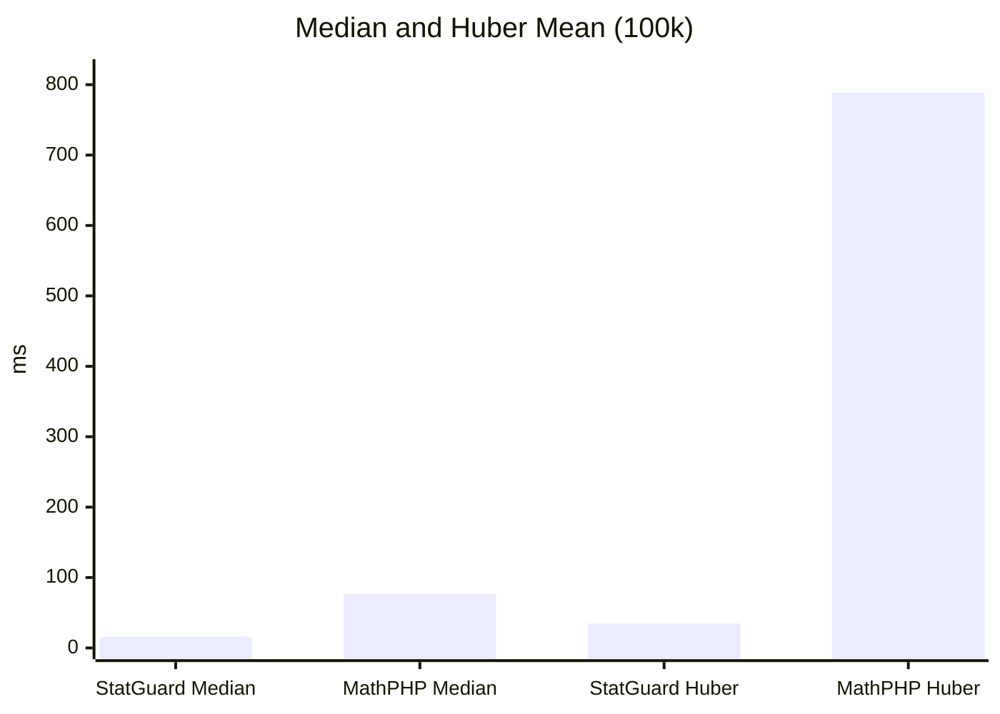

# Benchmarks

## Metodologia

- Dataset: 100,000 floats pseudoaleatorios (seed fija).
- Entorno: ejecucion local con PHP 8.x y el script `tests/BenchmarkStatGuard.php`.
- Comparativas: StatGuard vs MathPHP (cuando existe equivalente) y paridad numerica con R.
- R usa `system.time()` y solo mide computo (se excluye la carga del CSV).

Para generar y actualizar la tabla en Markdown:

```bash
php tests/BenchmarkStatGuard.php report
```

## Paridad Cientifica (vs R)

StatGuard replica los 9 tipos de cuantiles de R y contrasta sus resultados con el motor base de R. Los valores de referencia en la tabla permiten comparar salida numerica y tiempos.
La columna Status marca ✅ cuando la diferencia absoluta entre StatGuard y R es menor a 0.0001.

<!-- BENCHMARK_PARITY_START -->

| Method | StatGuard ms | StatGuard value | MathPHP ms | MathPHP value | R ms | R value | Status |
| :--- | ---: | ---: | ---: | ---: | ---: | ---: | :---: |
| Median | 15.43 | 499.249 | 77.24 | 499.249 | 2.00 | 499.249 | ✅ |
| Quantile Type 1 (p=0.75) | 15.80 | 747.736 | 15.69 | 747.7385 | 2.00 | 747.736 | ✅ |
| Quantile Type 2 (p=0.75) | 14.64 | 747.741 | 15.45 | 747.7385 | 2.00 | 747.741 | ✅ |
| Quantile Type 3 (p=0.75) | 14.49 | 747.736 | 15.46 | 747.7385 | 2.00 | 747.736 | ✅ |
| Quantile Type 4 (p=0.75) | 14.45 | 747.736 | 16.71 | 747.7385 | 1.00 | 747.736 | ✅ |
| Quantile Type 5 (p=0.75) | 17.31 | 747.741 | 16.22 | 747.7385 | 1.00 | 747.741 | ✅ |
| Quantile Type 6 (p=0.75) | 15.20 | 747.7435 | 15.93 | 747.7385 | 1.00 | 747.7435 | ✅ |
| Quantile Type 7 (p=0.75) | 15.08 | 747.7385 | 16.12 | 747.7385 | 2.00 | 747.7385 | ✅ |
| Quantile Type 8 (p=0.75) | 14.78 | 747.741833 | 16.38 | 747.7385 | 2.00 | 747.7418 | ✅ |
| Quantile Type 9 (p=0.75) | 14.42 | 747.741625 | 15.24 | 747.7385 | 2.00 | 747.7416 | ✅ |
| Huber mean | 32.37 | 499.174389 | 39.15 | 499.243589 | 7.00 | 499.18 | ❌ |

<!-- BENCHMARK_PARITY_END -->

!!! info
	La tabla se actualiza automaticamente con `php tests/BenchmarkStatGuard.php report`.

## Rendimiento (vs MathPHP)

StatGuard mantiene competitividad en operaciones clasicas y supera a MathPHP en estadistica robusta. Los benchmarks mas representativos muestran una ventaja clara en mediana y Huber.



## Conclusiones

StatGuard es la unica libreria PHP que garantiza paridad con los 9 tipos de cuantiles de R y entrega un rendimiento superior a MathPHP en operaciones criticas de estadistica robusta.

Built with ❤️ by cjuol.
